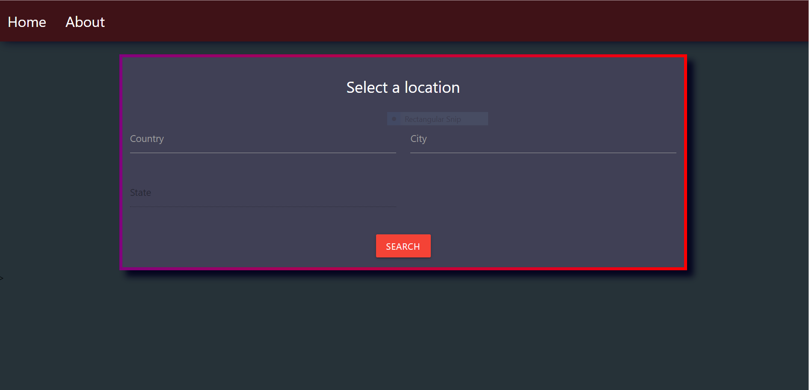
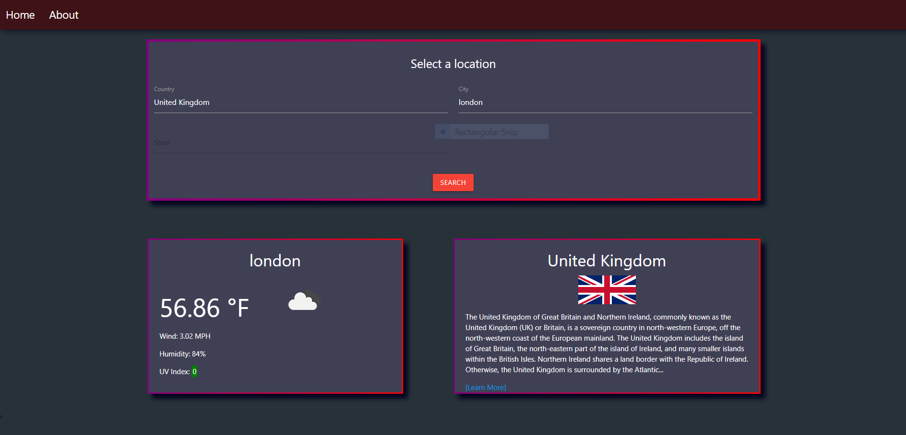

# Project 1: Travel Guide

## Team_4_Project introduction:

This is a travel guide website, we have used the third-party APIs and it allows developers to access their data and functionality by making requests with specific parameters to a URL. we are retrieving data from another application's API and using it in the context of our own. We have used client-side storage to store persistent data. Kanban planning helped us with the github repository project planner so that we could stay on task, and remember what was to come in the building process.

## The user story:
As a user I'd want to view the basic facts on a specific country, as well as the average temperature, so that I may learn more about it before arranging a trip.

When we want to view a city weather with its information, we go to the deployed link and it display the data accordingly. 
Click on "Get Started" it takes you to another page. 
Second page takes the input of country and city which results in the usage of three api servers.
At the ends these functions results into displaying the entered city weather, country information and the country flag.

## We have used the following  API's in our application:

* [Weather API](https://openweathermap.org/).

Check the desired country through user selection. Use an established script to fetch the information. Then present the weather information to the user so that they may plan according to the weather.

* [Wikipedia API](https://www.mediawiki.org/wiki/API:Main_page)

Check desired country through user selection. Use the established scripts to search the wikipedia database. Then displays the flag of the selected country as well as a handful of educational information so the user may learn something about the culture they may be experiencing in person in the coming days.

* [Flagpedia API](https://flagpedia.net/download/api)

Needed ISO country codes for OpenWeather Provided name -> code functions Had difficulty with Wikipedia API’s images Provided name -> flag png functions Excellent ‘helper’ API.

## Mock-Up

The following images shows the web application's appearance and functionality:

 This travel guide app includes a GET STARTED option, a list of countries,  current-day forecast, wekipedia information of the country and image of its flag.

##  Deployed wesite link

[Click here to view Travel Guide](https://jkohrt7.github.io/Team_4_Project/)

## Github:

* [ Darnley.](https://github.com/dcorbiniii)
* [ Graham.](https://github.com/NXTGenforcer)
* [ Jared.](https://github.com/jkohrt7)
* [ Mandy.](https://github.com/mandy2324)
* [ Sean.](https://github.com/McTastic)